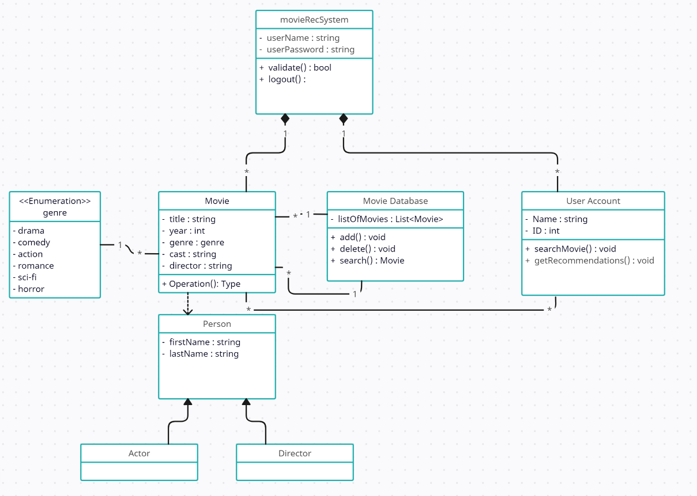
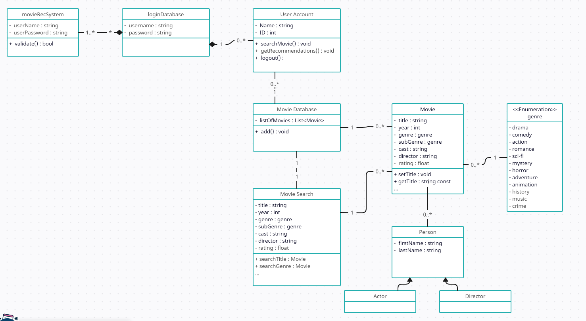

# Movie Recommender
 
 Authors: [Thomas Nguyen](https://github.com/Xekuu) [Randy Pham](https://github.com/randypham037) [Alex Back](https://github.com/Abackq) [Tayvin Nguyen](https://github.com/TayvinN)

## Project Description

 * This is important to people that are struggling with deciding on a particular movie and don't know where start.
 * Languages and tool we will be using is C++, Visual Studio Code
 * The inputs of our project from the user will be along the lines of movie genres, movie ratings, age of user, profiles, etc. Outputs will be a list of recommended movies according to the user's interests.
 * The features that this project provides is recommending shows or movies that are of most interest and popular shows etc. This project will have a catalog of movies that can be narrowed down using mulitple different filters such as the genre, age-appropriate movies, how old the movie is, ratings, actors, directors, etc. Movies can also be sorted according to the filters. Users can use the search within the terminal to input specific movies and our program will take the input of the user and perform a search based on our external movie database, our application will recommend other movies in the same genre or movies with the same actor. 

## User Interface Specification

### Navigation Diagram

### Screen Layouts
The login menu will ask the user for their username first then password. Once they have logged in they will be directed to the Catalog of Movies where we can see the latest movies that were released. The Catalog acts more like a menu than actually recommending movies, as such we can get to the logout, search bar, filter, and recommended movies. The logout option will logout the user and take them back to the login screen. The search bar will just allow the user to type into the terminal and search for movies directly. The Filter Movies option will ask the user to choose to filter by rating, directors, genres, quality, and trending. The recommended movies option will recommend movies to the user if they have preferred options, if not then it will automatically recommend trending movies. The user will be able to select a movie to see a longer description of that movie according to all the available filters.

## Class Diagram

For this system, we are implementing a simple authentication/login menu along with multiple avenues of searching/finding movies recommended by the system; some of these include search by director, similar genre, and actor. In order to develop this system, the diagram depicted here is necessary in order to visualize the required classes of our system. Derived classes of actor(s) and director(s) need to be included for us to be able to search the list for these objects. The movies object would need to hold the title, release year (this is another one of our search filters), genre, cast and director; these attributes are held within the class. An efficient data structure would need to be used to hold the database of movies -- the list is put there temporarily. If we are to use an open-source database for our movie list, searching would take any possibility of time, so implementation of an efficient searching algorithm would be necessary.

This updated UML diagram applies the points that were mentioned during our TA scrum meeting as well as implements the Single-Responsibility principle of the SOLID principles. In order to apply the solid principle, two classes were added: the loginDatabase as well as the Movie Search class. Before, the user account was responsible for validating the user account information from the starting interface, or movieRecSystem class; with the inclusion of the loginDatabase, the new class facilitates the login validation from the starting interface and then sends the user to their account. The Movie Search class aims to do something similar by relieving the Movie Database class from having to perform specific search operations on the database. The Single-Responsibility principle aims to isolate changes on the system and reduce the impact bugs if they were to occur.

 > ## Phase III
 > You will need to schedule a check-in for the second scrum meeting with the same reader you had your first scrum meeting with (using Calendly). Your entire team must be present. This meeting will occur on Zoom and should be conducted by Wednesday of week 8.
 
 > BEFORE the meeting you should do the following:
 > * Update your class diagram from Phase II to include any feedback you received from your TA/grader.
 > * Considering the SOLID design principles, reflect back on your class diagram and think about how you can use the SOLID principles to improve your design. You should then update the README.md file by adding the following:
 >   * A new class diagram incorporating your changes after considering the SOLID principles.
 >   * For each update in your class diagram, you must explain in 3-4 sentences:
 >     * What SOLID principle(s) did you apply?
 >     * How did you apply it? i.e. describe the change.
 >     * How did this change help you write better code?
 > * Perform a new sprint plan like you did in Phase II.
 > * You should also make sure that your README file (and Project board) are up-to-date reflecting the current status of your project and the most recent class diagram. Previous versions of the README file should still be visible through your commit history.
 
> During the meeting with your reader you will discuss: 
 > * How effective your last sprint was (each member should talk about what they did)
 > * Any tasks that did not get completed last sprint, and how you took them into consideration for this sprint
 > * Any bugs you've identified and created issues for during the sprint. Do you plan on fixing them in the next sprint or are they lower priority?
 > * What tasks you are planning for this next sprint.

 
 > ## Final deliverable
 > All group members will give a demo to the reader during lab time. ou should schedule your demo on Calendly with the same reader who took your second scrum meeting. The reader will check the demo and the project GitHub repository and ask a few questions to all the team members. 
 > Before the demo, you should do the following:
 > * Complete the sections below (i.e. Screenshots, Installation/Usage, Testing)
 > * Plan one more sprint (that you will not necessarily complete before the end of the quarter). Your In-progress and In-testing columns should be empty (you are not doing more work currently) but your TODO column should have a full sprint plan in it as you have done before. This should include any known bugs (there should be some) or new features you would like to add. These should appear as issues/cards on your Project board.
 > * Make sure your README file and Project board are up-to-date reflecting the current status of your project (e.g. any changes that you have made during the project such as changes to your class diagram). Previous versions should still be visible through your commit history. 
 
 ## Screenshots
 > Screenshots of the input/output after running your application

 ## Installation/Usage
 > Instructions on installing and running your application
There are no installations needed to run our application. To run, build with cmake . and make, then run the executable ./movieRecTest. The program will continue to run and capture user input until the user is logged out and chooses to exit the program. 
 ## Testing
 > How was your project tested/validated? If you used CI, you should have a "build passing" badge in this README.
 
